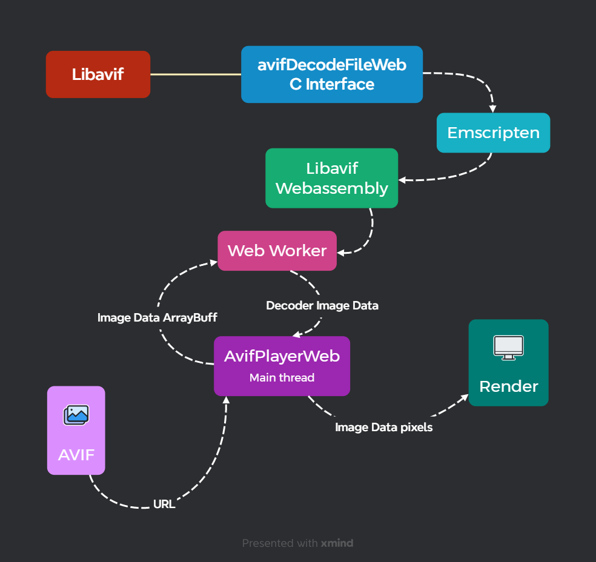

# avif-player-web

使用[Webassembly][Webassembly]播放[AVIF][AVIF]动画文件。单帧的图像也是支持的，但是因为每个图像都会创建一个解码器和[Worker][Worker]线程，而且解码时间过长，所以意义不大。这个库使用了[Emscripten][Emscripten]编译[Libavif](https://github.com/AOMediaCodec/libavif)为[Webassembly][Webassembly]从而提供向后兼容的AVIF文件的支持

只支持`8bit`色深文件，每个AvifPlayerWeb对象创建播放时都会新建一个[Worker][Worker]线程

[](https://www.npmjs.com/package/avif-player-web)

## 安装

```shell
# npm
npm i avif-player-web

# yarn
yarn add avif-player-web
```

## 示例

### 播放一个动画文件

```html
<canvas id="canvas"></canvas>
```

```typescript
import AvifPlayerWeb from "avif-player-web";

// 每个AvifPlayerWeb对象创建播放时都会新建一个Worker线程
// 第二个参数可以是配置对象
const avifPlayerWeb = new AvifPlayerWeb.AvifPlayerWeb(
  // 你的avif文件链接
  "www.example.com/animation.avif",
  // 传入canvas DOM对象或id
  document.getElementById("canvas"),
  {
    // 配置项列出了所有配置选项
    // 自动播放
    autoplay: true,
  }
);

avifPlayerWeb.on(
  // AvifPlayerWeb对象的所有事件都在AvifPlayerWebChannel枚举中
  AvifPlayerWeb.AvifPlayerWebChannel.frameIndexChange,
  (data) => {
    console.log(data.index);
  }
);
```

### 显示单帧的图像文件

```typescript
import AvifPlayerWeb from "avif-player-web";

const avifPlayerWeb = new AvifPlayerWeb.AvifPlayerWeb(
  "www.example.com/one.avif",
  document.getElementById("canvas"),
  {
    // 这样才能一开始就显示图像
    autoplay: true,
  }
);

avifPlayerWeb.on(AvifPlayerWeb.AvifPlayerWebChannel.end, (data) => {
  // 播放完成后销毁Worker线程以节省内存
  avifPlayerWeb.destroy();
});
```

## 配置

`AvifPlayerWeb`对象的所有可选配置

```typescript
/**
 * 可选配置项
 */
export interface AvifPlayerWebOptions {
  /**
   * 传入canvas DOM对象或id
   */
  canvas?: string | HTMLCanvasElement;
  /**
   * 启用webgl api渲染
   */
  webgl?: boolean;
  /**
   * 循环播放次数，0表示无限循环播放，默认1
   */
  loop?: number;
  /**
   * 初始化完成后立即播放
   */
  autoplay?: boolean;
  /**
   * 是否开启异步解码，开启这个播放系统将尽可能的解码每一帧，播放将会更流畅，副作用是占用内存大，暂停后重新播放时可能有延迟，默认false
   */
  async?: boolean;
  /**
   * 开启异步解码时图像数据缓冲区允许最大的内存占用，这个值是根据`pixels.byteLength`图像数据大小计算的，真正占用的内存空间会比这个值略大，默认`67108864`即`64MB`，单位`byte`
   */
  arrayBuffSize?: number;
  /**
   * 实例化对象时立刻初始化解码器，默认false
   */
  initDecoderInstantly?: boolean;
  /**
   * 实例化对象时立刻初始化解码器并开始下载解析AVIF文件，默认false
   */
  initDecoderAvifInstantly?: boolean;
  /**
   * 是否启用边下边播功能，默认开启
   */
  enableStreaming?: boolean;
}
```

### 配置项补充

#### `async`异步解码

异步解码本质就是缓存提前解码后的图像数据，这个功能是能提高播放动画流畅度的，特别是对于帧率较高的动画文件来说

##### 为什么


> 上图 I、P 、B帧是[H264][H264]编码方式，AV1编码使用了类似的技术

这是视频编码方式的问题，[AVIF][AVIF]文件是使用[AV1][AV1]视频编码技术对图像或动图进行编码的。[AV1][AV1]视频编码技术使用了[帧间预测][IntraPrediction]的技术，简单说就是部分编码后的帧，解码时是需要通过复杂计算才能得出完整帧，所以不同的帧解码时间是不一样的。这时可以将解码快的帧缓存起来，只要当前帧播放时长大于解码时间。这样就能有时间去解码[帧间预测][IntraPrediction]的帧，从而保证整体的流畅播放。


### 其它

#### 推荐的[AVIF][AVIF]动画参数

推荐动画文件的分辨率不超过750px\*750px，帧率不超过25帧，这样能最大程度保持播放的流畅和画面的清晰

### 不同格式之间的简单对比

可以看出[AVIF][AVIF]文件大小方面的优势是很明显的，这也是为什么做这个库的原因

| 格式                                                   | 展示                                                                    | 文件大小 |
| ------------------------------------------------------ | ----------------------------------------------------------------------- | -------- |
| [H264][H264]_(原视频文件[来源(Pinterest)][Pinterest])_ | <video width="200px" src="doc/animation.mp4" controls></video>          | 5.77MB   |
| [APNG][APNG]                                           |                              | 68.7MB   |
| [VAP][APNG]_([H265][H265])_                            | <video width="200px" src="doc/animation_vap_h265.mp4" controls></video> | 2.03MB   |
| [VAP][APNG]_([H264][H264])_                            | <video width="200px" src="doc/animation_vap_h264.mp4" controls></video> | 2.52MB   |
| [AVIF][AVIF]                                           |                             | 1.65MB   |

## 如何实现

解码的流程



[Emscripten]: https://emscripten.org/ "Emscripten"
[Webassembly]: https://webassembly.org "Webassembly"
[AVIF]: https://en.wikipedia.org/wiki/AVIF "AVIF"
[Worker]: https://developer.mozilla.org/zh-CN/docs/Web/API/Web_Workers_API/Using_web_workers#web_workers_api "Worker"
[AV1]: https://en.wikipedia.org/wiki/AV1 "AV1"
[H264]: https://en.wikipedia.org/wiki/Advanced_Video_Coding "H264"
[H265]: https://en.wikipedia.org/wiki/High_Efficiency_Video_Coding "H265"
[IntraPrediction]: https://en.wikipedia.org/wiki/Intra-frame_coding "IntraPrediction"
[APNG]: https://en.wikipedia.org/wiki/APNG "APNG"
[Pinterest]: https://www.pinterest.es/pin/42221315251843026/ "Pinterest"
